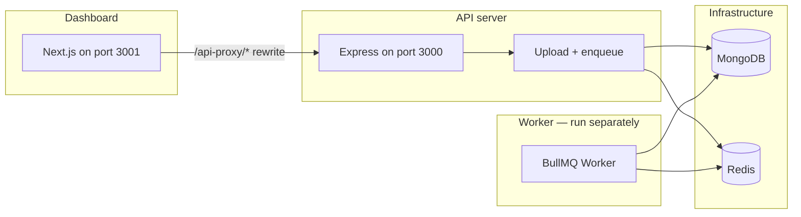

# Job Queue — CSV processing dashboard

A small full-stack app: an **Express** API accepts CSV uploads, enqueues work on **Redis** via **BullMQ**, and a **Next.js** dashboard polls job status. A **separate worker process** drains the queue and processes files asynchronously.

---

## Architecture



### Design decisions

| Area | Choice | Rationale |
|------|--------|-----------|
| **Queue** | BullMQ on Redis | Durable jobs, retries with exponential backoff, progress updates, and horizontal scaling of workers. |
| **API vs worker** | Separate Node processes | Uploads and HTTP stay responsive; heavy CSV work runs out-of-band with configurable concurrency (`MAX_CONCURRENCY`). |
| **Persistence** | MongoDB for job documents | Job metadata, status, and results are queryable for listing and detail views. |
| **Uploads** | Streaming (Busboy), disk storage | Large files are handled without loading the whole file into memory; paths are passed to the worker. |
| **Dashboard** | Next.js with rewrites | Browser calls `/api-proxy/...` so the UI avoids CORS issues in development; production can align `NEXT_PUBLIC_API_URL` with your API host. |
| **Safety** | Helmet, CORS, rate limiting on uploads | Baseline HTTP hardening and abuse throttling on the upload route. |

The API **enqueues** jobs only; it does **not** process CSV rows. If the worker is not running, jobs remain queued (or pending in the database) until a worker consumes them.

---

## Prerequisites

- **Node.js** (LTS recommended)
- **MongoDB** (local or remote)
- **Redis** (BullMQ requires a running Redis instance)

---

## Environment variables

Create `server/.env` (you can start from `server/.env.example` if present). Typical variables used by the codebase:

| Variable | Purpose | Default / notes |
|----------|---------|-----------------|
| `MONGODB_URI` | MongoDB connection string | `mongodb://localhost:27017/job-queue-system` |
| `REDIS_URL` | Redis connection URL for BullMQ | **Should be set** (e.g. `redis://localhost:6379`) |
| `PORT` | HTTP API port | `3000` |
| `QUEUE_NAME` | BullMQ queue name | `file-processing` |
| `JOB_RETRY_ATTEMPTS` | Failed job retries | `3` |
| `JOB_RETRY_DELAY_MS` | Backoff base delay (ms) | `5000` |
| `UPLOAD_DIR` | Directory for uploaded files | `./uploads` (relative to server cwd) |
| `MAX_FILE_SIZE_MB` | Max upload size | `500` |
| `ALLOWED_FILE_TYPES` | MIME types | CSV-related types |
| `MAX_CONCURRENCY` | Worker parallel jobs | `5` |

**Dashboard** (`dashboard/.env.local` optional):

| Variable | Purpose |
|----------|---------|
| `NEXT_PUBLIC_API_URL` | Backend base URL used by Next rewrites (default `http://localhost:3000`) |

---

## Step-by-step: install and run

### 1. Start infrastructure

1. Start **MongoDB** (e.g. local on port `27017`).
2. Start **Redis** (e.g. local on port `6379`).

### 2. Server (API)

```bash
cd server
npm install
```

Configure `server/.env` (at minimum `MONGODB_URI` and `REDIS_URL` to match your local services).

**Terminal A — API server:**

```bash
cd server
npm start
```

For development with auto-restart:

```bash
npm run dev
```

The API listens on **http://localhost:3000** by default (or `PORT`).

### 3. Worker (required for processing) — run separately

The worker **must** be started in its **own** process. It connects to MongoDB and Redis and processes jobs from the queue.

**Terminal B — worker:**

```bash
cd server
npm run worker
```

Development with auto-restart:

```bash
npm run dev:worker
```

Without this step, uploads may succeed and jobs may be created, but **CSV processing will not run**.

### 4. Dashboard (client)

**Terminal C:**

```bash
cd dashboard
npm install
npm run dev
```

Open **http://localhost:3001** (the app is configured to use port `3001`).

For production:

```bash
npm run build
npm start
```

---

## Execution summary (three processes)

| Step | Directory | Command | Role |
|------|-----------|---------|------|
| 1 | `server` | `npm start` (or `npm run dev`) | HTTP API + enqueue |
| 2 | `server` | `npm run worker` (or `npm run dev:worker`) | Process queue jobs |
| 3 | `dashboard` | `npm run dev` (or `npm run build` + `npm start`) | Web UI |

Ensure MongoDB and Redis are running before starting the server and worker.

---

## Assumptions and limitations

- **CSV-focused**: Processing logic targets CSV streams; other formats are not supported unless you extend the pipeline.
- **Worker is manual**: The repository runs the worker via a separate npm script; there is no in-process worker inside the Express app.
- **Single-machine uploads**: Files are stored on the local filesystem (`UPLOAD_DIR`). If you scale the API horizontally, workers must see the same storage (shared volume or object storage) or jobs will fail with “file not found.”
- **Redis and MongoDB availability**: The stack expects both services reachable; otherwise startup or job processing will fail.
- **Dashboard proxy**: In development, the Next app rewrites `/api-proxy/*` to the API; configure `NEXT_PUBLIC_API_URL` if the API is not on `http://localhost:3000`.

---

## API overview

- `POST /api/upload` — multipart upload + enqueue (rate limited).
- `GET /api/job/:id` — job status and result.
- `GET /api/jobs` — list jobs (query params as implemented).
- `GET /api/queue/stats` — queue statistics.
- `GET /api/health` — health check.

---

## License

See package metadata in `server/package.json` and `dashboard/package.json`.
